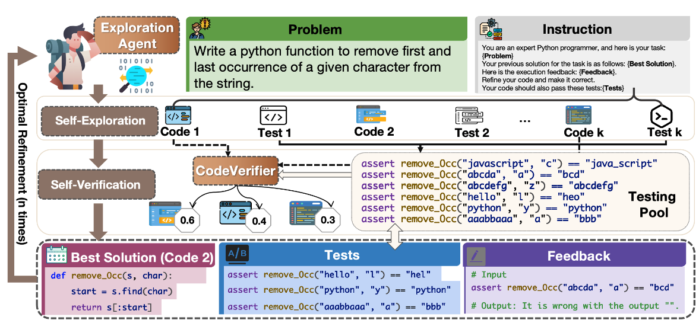

# ThinkCoder: Thinking Before Running! Efficient Code Generation with Thorough Exploration and Optimal Refinement

- [Abstract](#Abstract)

Code generation is crucial in software engineering for automating the coding process efficiently. While test-time computation methods show promise, they suffer from high latency due to multiple computation rounds. To overcome this, we introduce ThinkCoder, a framework that combines thorough exploration with optimal refinement. The exploration phase diversifies the solution space by searching for potential solutions, followed by a refinement phase that enhances precision. This approach allows us to select the best solution through careful consideration before taking action, avoiding excessive trial and error. To further minimize test-time computation overhead, we introduce preference-driven optimization with Reinforced Self-Training (ReST), which uses exploration trajectories from ThinkCoder to guide LLM's evolution. This approach enhances LLM's exploration efficiency via preference learning, cutting costs while maintaining accuracy. ThinkCoder boosts the performance with a single LLM, excelling on benchmarks like HumanEval and MBPP. Compared to SOTA models, it improves Pass@1 by 3.0% over MapCoder with just 6.4\% of the computation cost. Against AgentCoder, ThinkCoder achieves a 0.5% higher Pass@1 after 2 rounds, outperforming AgentCoder's 5 rounds. Additionally, ReST with success trajectories enhances efficiency, allowing models like LLaMA2-7B to achieve competitive results using only 20% of the computational resources. These results highlight the framework's effectiveness and scalability. 

- [ThinkCoder Overview](#ThinkCoder)

- [Preference-driven Optimization](#Preference)

- [Results](#Results)

Table 1. ThinkCoder performance of various LLMs. n = 0 indicates results without the framework. n > 0 indicates results after n iterations of ThinkCoder, with each exploration generating k = 5 solutions for optimal refinement at temperature t = 0.5. Percentages in parentheses show improvement over the base LLMs.

Table 2. Pass@1 for MapCoder, AgentCoder, and ThinkCoder on MBPP, MBPP-ET, HumanEval, and HumanEval-ET benchmarks with GPT-3.5-Turbo and GPT-4-Turbo as the backbone.

Table3. Pass@1 for LDB, LPW, and ThinkCoder on MBPP, MBPP-ET, HumanEval, HumanEval-ET, and CodeContests benchmarks with GPT-4o as the backbone.

Table 4. ThinkCoder performance on LiveCodeBench and CodeContests. n represents the self-refinement budget, with the self-exploration budget fixed at k = 5.

Table 5. The token usage for agent responses and the required refinement iterations in ThinkCoder for HumanEval and MBPP, compared to MapCoder (as ThinkCoder and MapCoder share similar configurations), with GPT-4-Turbo as the base LLM. The tiktoken package is used to calculate the response token usage.

Table 6. Performance comparison of the LLama2-7B model under different settings: baseline without fine-tuning, supervised fine-tuning (SFT) with original train dataset, and Reinforced Self-Training (ReST) with success trajectories from ThinkCoder on the MBPP dataset.

- [Running our project](#Runing)

1、 Clone the project and create a new conda and install the requirements.

git clone git@github.com:xiaoqzhwhu/ThinkCoder.git && cd ThinkCoder/bin/;

pip install -r requirements;

2、Run the ThinkCoder framework for code generation and evaluation.

sh evaluate.sh;

3、Run the preference-driven optimization;

sh train.sh;

